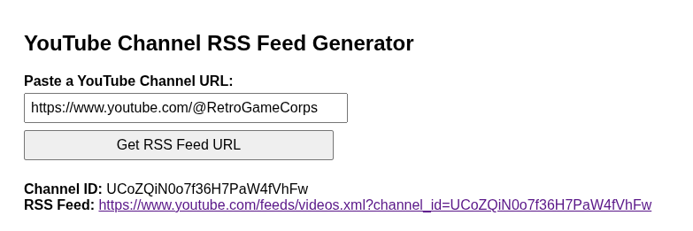

# YouTube Channel RSS Feed Generator

A simple web tool to extract and generate the RSS feed URL for any YouTube channel—just enter a channel URL and instantly get its RSS link!

---

---

## 🔗 Live Demo

🟢 Try it now:
👉 [https://arraytools.github.io/youtubechannel-rss/](https://arraytools.github.io/youtubechannel-rss/)

No installation needed—open it in your browser and start generating RSS feed URLs for YouTube channels instantly!

## ⭐ Features

- **Easy to Use:** Paste any YouTube channel URL (supports `/@handle`, `/channel/`, `/user/`, and `/c/` formats)
- **No API Keys Required:** Works directly in your browser—no setup or accounts necessary
- **Fast:** Instantly generates the official RSS feed link for all channel uploads

## 🚀 How to Use

1. **Download or clone** this repository to your computer.
2. **Open the `index.html` file** with any modern web browser (Chrome, Firefox, Edge, etc.).
3. **Paste a YouTube channel URL** into the input box.
4. **Click "Get RSS Feed URL"**.
   The RSS feed link will be shown below, ready to use in any RSS reader!
